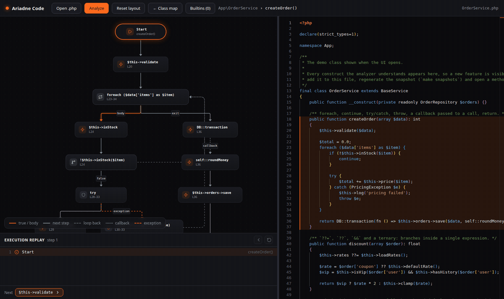

# Ariadne Code

[](https://github.com/b40y22/ariadne-code/actions/workflows/ci.yml)
[](LICENSE)


Static analyzer that turns PHP source into a language-agnostic **Code Graph**: the thread through the labyrinth of legacy code.


> **Status: 0.1, with multi-file analysis on `main`.** Classes, functions and plain scripts, the control flow of every method, and a step-by-step replay of it. The command line analyzes a whole directory and follows calls across files; the web UI still opens one file at a time. See the [changelog](CHANGELOG.md) and the [roadmap](#roadmap).

```
PHP source → AST (nikic/php-parser) → Analyzer → Code Graph (JSON) → visualization
```

Principle: **static analysis first, visualization second, AI third.** The graph only contains what the code actually says. Whatever cannot be resolved statically is marked as such instead of being guessed.

## Quick start

Everything runs in Docker, so no local PHP or Node is required.

```bash
make build
make install
make web-install
make up    # UI on http://localhost:5180, API on http://localhost:8090
```

### Web UI

The page shows the class map next to the source code. Click a node to jump to its code; move the cursor in the editor to highlight the matching node. Use **Open .php** to analyze your own file.

Calls into code outside the file (`external`) and calls the analyzer cannot trace to a declaration (`unresolved`) are hidden on the map by default, because there are often more of them than real nodes; the **External & unresolved (N)** button shows them. A class with more than 14 methods is laid out as a grid, four across, instead of a column that would have to be shrunk until nothing can be read. Classes are containers that hold their methods and can be resized; drag any block and the layout is remembered per file.

**Method flow:** double-click a method (or select it and press **Show flow**) to see how it runs: its calls in execution order, `if` branches (`true`/`false`), loops, `try`/`catch`, `return` and `throw`. A flow can be shared by link, e.g. `http://localhost:5180/#method=method:App\OrderService::createOrder`.


`switch` and `match` branch per case; a `case` without `break` falls through to the next one:


**Execution replay:** below a method flow, the *Execution replay* panel walks through the method step by step. **→** takes the next step (or pick a branch when the code forks), **←** goes back, and a click on a log entry jumps to that step. The path walked so far lights up in the graph, and the current step is highlighted in the source code. It is static: no code runs, you choose the branches.



The API is a single endpoint, `POST /api/analyze` with `{"code": "...", "file": "A.php"}`, answering with the Code Graph JSON. Submitted code is only parsed, never executed or stored, and requests are limited to 1 MB.

`make demo` analyzes the demo class [`tests/fixtures/OrderShowcase.php`](tests/fixtures/OrderShowcase.php) on the command line and prints its graph as JSON. To analyze your own code, give it files or directories; everything given is one project, so calls are followed from file to file:

```bash
docker compose run --rm php php bin/ariadne analyze path/to/YourClass.php
docker compose run --rm php php bin/ariadne analyze path/to/project/app > graph.json
```

Directories are read recursively for `.php` files, skipping `vendor`, `node_modules` and `.git`. A file that does not parse is reported on stderr and left out. A 590-file Laravel application takes a few seconds.

## Code Graph format

```json
{
  "nodes": [
    { "id": "method:App\\OrderService::createOrder", "type": "method", "name": "createOrder", "file": "OrderService.php", "lineStart": 11, "lineEnd": 18, "parent": null },
    { "id": "unresolved:$this->orders->save", "type": "unresolved", "name": "$this->orders->save", "file": null, "lineStart": null, "lineEnd": null, "parent": null }
  ],
  "edges": [
    { "from": "method:App\\OrderService::createOrder", "to": "unresolved:$this->orders->save", "type": "calls", "line": 17, "label": null }
  ]
}
```

| Node type    | Meaning                                                              |
|--------------|----------------------------------------------------------------------|
| `class`      | A named class                                                        |
| `method`     | A method declared in a class                                         |
| `function`   | A function declared outside any class                                |
| `script`     | The code of a file that sits outside every class and function: what runs when the file is executed |
| `external`   | A method of a class outside the analyzed files (a library, the framework): known by name, nothing to show inside |
| `unresolved` | A call target that static analysis cannot map to a known declaration |
| flow nodes   | `start`, `end`, `call`, `builtin`, `condition`, `loop`, `try`, `catch`, `finally`, `return`, `throw`: the control flow of one method, linked to it through `parent` |

| Edge type  | Meaning                                                                  |
|------------|--------------------------------------------------------------------------|
| `contains` | A class declares a method                                                |
| `calls`    | A method calls another; `line` is the call site                          |
| `flow`     | Execution order inside a method; `label` names the branch taken         |

### Method flow

Every method with a body also gets its control flow: calls in execution order, joined by `flow` edges. Branch edges carry a `label`: `true`/`false` (conditions), `body`/`next`/`exit`/`continue` (loops), `exception`/`throw` (try/catch), `set`/`null` (`??`, `??=`), `callback`, and the case value for `switch` and `match`.

Analyzing [`ShippingService`](tests/fixtures/ShippingService.php) gives, for `ship()`, among others:

```
start -> condition $items === []
condition $items === [] -> return false                   [true]
condition $items === [] -> loop foreach ($items as $item)  [false]
loop foreach ($items as $item) -> call $this->inStock      [body]
call $this->inStock -> condition !$this->inStock($item)
condition !$this->inStock($item) -> loop foreach ...       [true]
condition !$this->inStock($item) -> try                    [false]
...
```

Deliberate simplifications (the graph never claims more than it knows):

- Expressions branch where PHP does: `?:` and ternaries (`true`/`false`), `??` and `??=` (`set`/`null`), and `&&`/`||` when their right side calls or throws. A `throw` inside an expression (`$x ?? throw new E()`) leaves the method, so a call after it runs only on the surviving path.
- `switch` branches per `case` (labelled with the case value, or `default`; `no match` when there is no default) and falls through like PHP until a `break`; `match` branches per arm. Calls inside a `case` value itself are not steps.
- Calls in loop headers (`while ($this->next())`) are not steps, because they run on every iteration.
- `do ... while` is drawn like `while`, with the condition node before the body.
- Exceptions raised by called methods are unknown, so a `try` links to each of its `catch` blocks.
- `finally` is reached on normal completion only (not after `return`/`break` inside `try`).
- A closure or arrow function passed straight to a method or static call (`DB::transaction(fn () => ...)`) is a callback: its calls follow that call as plain steps, entered by a dotted `callback` edge. The analyzer cannot know whether the callee runs it, so the edge says "callback", not "runs". `return` and `throw` inside it never leave the method. Closures anywhere else add no steps. Callbacks nest to any depth; inside one, branching constructs are plain steps and a `throw` stays inside it.
- A `return` or `throw` whose expression is itself a call is a bare keyword: the call is already the step just before it, and repeating its text would show the same line twice. `throw new E()` and `return $x` keep their expression, so the exception type stays visible.
- `exit`/`die` end the flow like `return`. `include`/`require` are a step, but the included file is not followed.
- Code after an unconditional `return`/`throw`/`break`/`continue` is unreachable and left out.

Plain PHP scripts work too. A function is a node with its own flow, and the top-level code of a file becomes a `script` node named after the file, so a legacy page that is nothing but `require`, `if` and function calls still has a graph:


### Call resolution

All the analyzed files form one project: a call in one file reaches a method declared in another. A method is looked up in the class of the receiver, then in its parents, the way PHP does, case-insensitively. The receiver's class is known for:

- `$this->m()`, `self::m()`, `static::m()`, `parent::m()`, `Foo::m()` and `(new Foo())->m()`;
- `$this->repo->m()` when the property's class is guaranteed: a declared type (also on a promoted constructor parameter), a `@var Repo` docblock, or, in legacy code with neither, every `$this->repo = ...` in the class assigning a parameter typed `Repo` or a `new Repo()`;
- `$repo->m()` when `$repo` is a parameter typed with a class and never assigned in the body; closures see their own typed parameters and the ones they capture with `use`;
- chains of such properties: `$this->billing->invoices->show()`.

Functions resolve across files too (namespaced, imported with `use function`, or falling back to the global one).

When the lookup reaches a class that is not among the analyzed files (`Carbon::now()`, a model's `User::where()` handled by Eloquent's `Model`), the call ends in an `external` node named after that class. Everything else becomes an `unresolved` node: an untyped receiver, the result of another call (`$repo->find()->save()`), a method that may come from a trait, `__call` or one of an interface's implementations, a dynamic name such as `$this->$name()`. The graph never asserts something the code does not prove.

On the 2,500-line service from a real Laravel application, this took the share of unresolved calls from 94 % (one file alone) to 52 %, with 33 % reaching methods of the project and 15 % ending in the framework or a library.

**Builtins.** Calls to common pure PHP functions (`count`, `trim`, `array_merge`, `is_array`, `preg_match`...) are `builtin` steps rather than `call` steps. The UI hides them by default and rejoins the steps around them; the **Builtins (N)** button in a method flow brings them back. `header()`, `mysqli_query()` or `file_put_contents()` are not on the list, so they stay visible. The list is fixed in the code ([`QuietFunctions`](src/Analyzer/QuietFunctions.php)), not read from the running PHP, so the same code gives the same graph on every machine.

## Development

**CI.** Forgejo runs [`.forgejo/workflows/ci.yml`](.forgejo/workflows/ci.yml) and GitHub runs [`.github/workflows/ci.yml`](.github/workflows/ci.yml). They are separate files because the Forgejo runner is a plain `node:20-bookworm` image and `code.forgejo.org` mirrors `actions/checkout` but not `setup-php` or `setup-node`, so there PHP 8.5 comes from the sury.org apt repository ([`ci/install-php.sh`](ci/install-php.sh)). Both run Pint, PHPStan and PHPUnit, then the web app's types, tests and build. To try the Forgejo steps locally, run them in that image: `docker run --rm -v "$PWD":/work -w /work node:20-bookworm ci/install-php.sh`.

**The showcase.** [`tests/fixtures/OrderShowcase.php`](tests/fixtures/OrderShowcase.php) is the demo class the UI opens with, and its graph is pinned by a snapshot test. Every construct the analyzer understands appears in it. When you teach the analyzer something new, add an example of it there, run `make snapshots`, review the diff, and open the method in the UI: a feature that is not visible in the demo is not finished. A test fails if the showcase stops covering a kind of branch.

```bash
make check   # Pint (PER) + PHPStan level max + PHPUnit
make test
make stan
make fix     # auto-format
```

The project targets PHP 8.5; the Docker image has it, so nothing needs installing locally. The graph of every fixture in [`tests/fixtures`](tests/fixtures) is pinned by a snapshot test.

## Roadmap

- [x] Classes, methods and method calls to Code Graph JSON
- [x] Control flow inside methods: `if`/`else`, loops, `try`/`catch`, `throw`
- [x] `switch`/`match` branches
- [ ] `finally` after early exits
- [ ] Interfaces, traits, enums, inheritance and dependency edges
- [x] Type-aware call resolution: typed, promoted, docblock and constructor-assigned properties, typed parameters
- [x] Multiple files in the analyzer and the command line, with `external` targets
- [ ] Multiple files in the web UI: open a directory, code of each file next to the graph
- [ ] Return types of methods (`$repo->find()->save()`) and local variables assigned `new Foo()`
- [x] Web UI: class map with drag, zoom, auto-layout, resizable class containers, saved layout, linked to the source code
- [x] Web UI: method flow view
- [x] Execution replay: step through a method, choosing branches (static, no runtime tracing)
- [ ] Web UI: expand/collapse of dependencies
- [ ] AI explanations grounded in the graph

## Contributing

See [CONTRIBUTING.md](CONTRIBUTING.md): how to run the checks, the showcase rule and the commit format.

## License

[MIT](LICENSE)

## Authors

Designed and maintained by Yevgen. Developed with [Claude Code](https://claude.com/claude-code).
